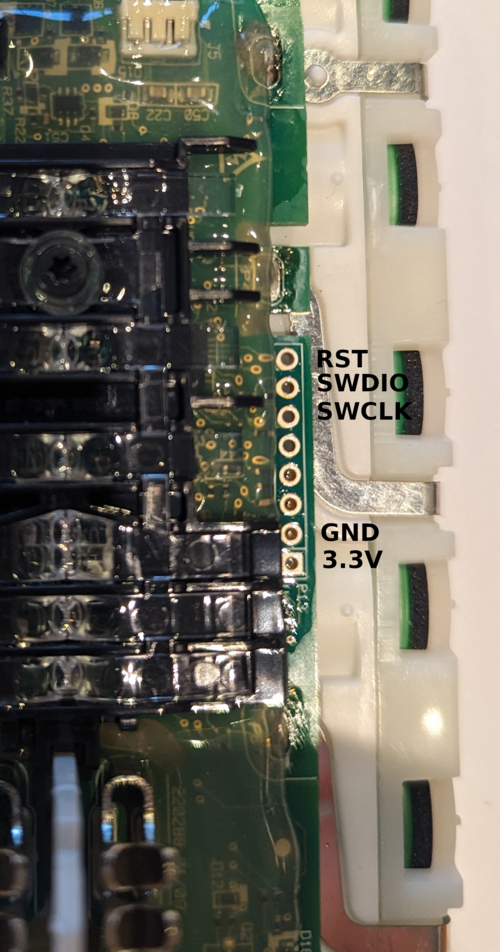

# V11_Dyson_BMS

Aftermarket firmware for Dyson V11/V15 Battery Management Systems.

Based on [davidmpye/V10_Dyson_BMS](https://github.com/davidmpye/V10_Dyson_BMS).

> [!CAUTION]
> This project works with high-current lithium-ion battery packs. Incorrect
> wiring, short circuits, damaged cells, or incorrect firmware can cause fire,
> toxic fumes, injury, or permanent damage to the battery, programmer, or vacuum.
>
> The firmware is provided for educational, experimental, and research purposes.
> The authors and contributors are not responsible for damage, injury, loss, or
> legal consequences resulting from its use. If you do not understand the risks
> of working with lithium batteries, do not use this project.

## Scope and Compatibility

Compatibility must be determined from the electronics inside the pack, not only
from the vacuum model printed on the enclosure. A supported board uses:

| Component | Required hardware |
|-----------|-------------------|
| MCU | Microchip ATSAMD20E15, ARM Cortex-M0+, 32 KB flash, 4 KB RAM |
| BMS frontend | Texas Instruments BQ7693003 at I2C address `0x08` |
| Cell configuration | 7 cells in series (7S) |

The firmware supports these configurations when the board uses the MCU and BMS
frontend listed above:

| Vacuum family | Firmware configuration | Status |
|---------------|------------------------|--------|
| Dyson V11, click-in or screw-in pack | `TRIGGER_TOGGLE_MODE=0` | Supported |
| Dyson V15 | `TRIGGER_TOGGLE_MODE=0` | Supported on known compatible boards; verify the PCB before flashing |
| Dyson V12 | `TRIGGER_TOGGLE_MODE=1` | Supported on compatible boards with a toggle trigger |

Different revisions within one model family may use another MCU or PCB. Dyson
V10 battery boards, LPC804-based boards, and motor-controller firmware are
outside the scope of this repository. If your board differs, open an issue and include
the vacuum model, SV number, battery label, PCB markings, MCU marking, and clear
photos of both sides of the PCB.

The firmware implements the Dyson serial protocol with TLV-based communication.

## Firmware Configuration

Compile-time options are located in `V11_BMS/src/config.h`.

| Define | Default | Purpose |
|--------|---------|---------|
| `TRIGGER_TOGGLE_MODE` | `0` | Trigger behaviour. `0` = momentary (hold to run, the V11/V15 behaviour). `1` = toggle (each press flips run/stop; hold for ≥1 s to force stop). Set to `1` for the Dyson V12, whose trigger is a click-to-latch button rather than a held switch. |
| `SERIAL_DEBUG` | `1` | Enables human-readable UART diagnostic output. |
| `PROT_DEBUG_PRINT` | `1` | Enables Dyson protocol diagnostic output on the debug UART. |

## Building the Firmware

### Requirements

- `arm-none-eabi-gcc`
- CMake 3.20 or newer
- GNU Make
- OpenOCD with support for the selected SWD adapter (only needed for flashing;
  version 0.12.0 or newer for ST-Link)

### Command-line build (Linux / POSIX shell)

These commands use Bash on Linux or WSL. For Windows PowerShell, use the
[commands below](#windows-powershell). Compilation has been verified under WSL
with ARM GCC 13.2.1; this does not validate flashing or hardware operation.

On Ubuntu/Debian, install the build tools and the Newlib C library:

```bash
sudo apt update
sudo apt install build-essential cmake gcc-arm-none-eabi libnewlib-arm-none-eabi

cmake --version
arm-none-eabi-gcc --version
```

CMake must be version 3.20 or newer. For OpenOCD flashing and USB diagnostics,
also install `openocd` and `usbutils` (`sudo apt install openocd usbutils`).

Start in the repository root (the directory containing this README), then enter
the firmware directory:

```bash
cd V11_BMS
```

Skip this `cd` if already inside `V11_BMS`. **`CMakeLists.txt` is in the
`V11_BMS` subdirectory, not the repository root.** In WSL, a checkout on `C:` is
accessible under `/mnt/c/`; enter its `V11_BMS` subdirectory before continuing.

Configure a size-optimized Release build. Use a separate `build-linux` directory
to avoid reusing a Windows CMake cache, compiler path, or generator:

```bash
cmake -S . -B build-linux -G "Unix Makefiles" "-DCMAKE_TOOLCHAIN_FILE=cmake/arm-none-eabi.cmake" "-DCMAKE_BUILD_TYPE=Release"
```

Only after configuration succeeds (`Configuring done` and `Generating done`),
build from the same `V11_BMS` working directory:

```bash
cmake --build build-linux --parallel "$(nproc)"
```

The outputs, relative to `V11_BMS`, are:

- `build-linux/samd20_firmware.elf`
- `build-linux/samd20_firmware.hex`

After editing source files, repeat only the build command. For Debug, rerun the
configure command with `"-DCMAKE_BUILD_TYPE=Debug"`, then build again.

Alternatively, the project's Makefile can configure and build using the same
directory (Release is the default):

```bash
make all BUILD_DIR=build-linux
```

Plain `make all` uses `build/` instead. Use the matching directory when flashing.
The `make flash` target selects **J-Link**, not ST-Link; for ST-Link, use the
[explicit OpenOCD commands](#st-link-with-openocd) with your build directory.

Both configurations use `-Os` to fit the firmware into the configured 30,208-byte
code region. Debug adds `-g3` symbols to the ELF file; these are not flashed to the
MCU. Optimization can make source-level stepping and local-variable inspection
less predictable. The previous `-Og` Debug build exceeds this region with ARM GCC
6.3.1.

Build troubleshooting:

- **Source directory does not contain `CMakeLists.txt`:** enter the `V11_BMS`
  subdirectory and repeat the configure command. A subsequent missing build
  directory or Makefile error is a consequence of the failed configuration.
- **Cache names another source directory or generator:** use a new build
  directory for both configure and build. Do not reuse Windows build caches in
  Linux/WSL.
- **Missing `nano.specs` or `libc_nano.a`:** check that
  `libnewlib-arm-none-eabi` is installed for the selected ARM toolchain.
- **`_read` / `_write` is not implemented and will always fail:** these
  [Newlib/libnosys warnings](https://sourceware.org/pipermail/newlib/2023/020793.html)
  can appear with `--specs=nosys.specs`. The current UART diagnostics format into
  a buffer with `snprintf()` and send through their own USART code, not standard
  input/output. In the inspected ARM GCC 13.2.1 build, the linker discarded these
  unused syscall functions and their `_r` wrappers from the final ELF. No dummy
  implementations are needed for that build. Reassess this if adding `printf()`,
  `scanf()`, or file I/O; those may need working syscall implementations.

WSL can build without access to the programming adapter. To flash from WSL 2,
first attach the USB probe using
[Microsoft's USB/WSL instructions](https://learn.microsoft.com/en-us/windows/wsl/connect-usb).
Alternatively, flash the generated ELF using OpenOCD on Windows. A successful
build alone does not mean the probe is accessible from WSL.

### Windows (PowerShell)

The following commands were verified with PowerShell 5.1, CMake 4.4, and the
ARM GCC 6.3.1 toolchain bundled with Atmel Studio 7. CMake must be available in
`PATH`. Adjust the compiler and Make paths if your installation differs.

Start in the repository root. Use a separate `build-stlink` directory to avoid
reusing a `build/CMakeCache.txt` copied from another computer or source location.
The directory name does not select the flashing adapter; the OpenOCD configuration
does that.

```powershell
cd V11_BMS

$env:Path = "C:\Program Files (x86)\Atmel\Studio\7.0\toolchain\arm\arm-gnu-toolchain\bin;" + $env:Path
arm-none-eabi-gcc --version

cmake -S . -B build-stlink -G "MinGW Makefiles" "-DCMAKE_TOOLCHAIN_FILE=cmake/arm-none-eabi.cmake" "-DCMAKE_BUILD_TYPE=Release" "-DCMAKE_MAKE_PROGRAM=C:/PROGRA~2/Atmel/Studio/7.0/SHELLU~1/make.exe"
```

Keep each complete `-DNAME=value` argument in quotes. In PowerShell, an unquoted
toolchain argument can be split before `.cmake`, producing `Ignoring extra path`
and `Could not find toolchain file` errors. The Make executable path above uses
Windows short directory names; a different installation can use its actual path
inside the same quoted argument.

Once configuration finishes successfully (`Configuring done` and `Generating
done`), build from the same `V11_BMS` working directory:

```powershell
cmake --build build-stlink --parallel 4
```

The outputs are:

- `V11_BMS/build-stlink/samd20_firmware.elf`
- `V11_BMS/build-stlink/samd20_firmware.hex`

After editing source files, repeat only the build command. The compiler `PATH`
setting applies to the current terminal; set it again in a new PowerShell session
so the build can also find `arm-none-eabi-size` and `arm-none-eabi-objcopy`.
For Debug, repeat the configure command with `"-DCMAKE_BUILD_TYPE=Debug"`, then
build again. Both configurations use `-Os`; Debug also includes `-g3` symbols.

Build troubleshooting:

- **Toolchain path stops before `.cmake`:** rerun the configure command with the
  entire `"-DCMAKE_TOOLCHAIN_FILE=cmake/arm-none-eabi.cmake"` argument quoted.
  It replaces the incorrect cached value; deleting the directory is not required.
- **`Makefile: No such file or directory`:** CMake configuration did not finish.
  Resolve the configure error before running `cmake --build`.
- **Cache names another source directory or generator:** choose a new build
  directory and use that same directory for the build and firmware image paths.

### Microchip Studio

Open `V11_BMS.atsln` in Microchip Studio (formerly Atmel Studio 7).

## Connecting the Programming Adapter

The programming header uses SWD. The marked pads are shown below.

<p align='center'>
  
</p>

Programming-header image based on the original
[V10_Dyson_BMS flashing documentation](https://github.com/davidmpye/V10_Dyson_BMS/wiki/Flashing).

### Required connections

| Battery pad | Adapter signal | Notes |
|-------------|----------------|-------|
| `SWDIO` | SWDIO | Bidirectional data |
| `SWCLK` | SWCLK | Clock |
| `GND` | GND | A common ground is mandatory |
| `RST` | RESET/nRESET | Recommended; may be required when recovering a protected device |
| `3.3V` | VTref/VTG sense input only | Connect only when the adapter requires a target-voltage reference |

> [!WARNING]
> The battery generates its own 3.3 V rail after it is awakened. Do not connect
> a programmer's 3.3 V power **output** to the battery's 3.3 V rail. J-Link
> `VTref` and Atmel-ICE `VTG` are voltage-sense inputs and may be connected to
> the battery's 3.3 V pad. Never connect the Raspberry Pi 3.3 V power pin.

The programming pads and cell connections may remain electrically live while
the case is open. Insulate tools and loose wires, and do not drill into a closed
battery pack. Press the battery trigger immediately before connecting so that
the BMS wakes and enables the MCU's 3.3 V supply. If detection fails, wake the
pack again and retry at a lower SWD clock.

## Flashing

Unlocking an original protected ATSAMD20 performs a **full chip erase**. The
original Dyson firmware cannot be backed up through SWD after the security bit
has been set. Treat unlocking as an irreversible operation.

Start with an SWD speed of 1 MHz. If communication is unreliable, reduce it to
100 kHz and keep the wires short.

### J-Link with OpenOCD

The default OpenOCD configuration is `V11_BMS/openocd_samd20.cfg`, and the Make
targets use this configuration.

```bash
cd V11_BMS

# Full erase/unlock of a protected device
make unlock

# Build, program, verify, and reset
make flash
```

After `make unlock` completes, the MCU contains no usable firmware. Always run
`make flash` before disconnecting the adapter.

### J-Link with SEGGER J-Flash

1. Connect `SWDIO`, `SWCLK`, `GND`, and `VTref`. Connect `RST` when available.
2. Select `Microchip ATSAMD20E15` as the target and `SWD` as the interface.
3. Set the initial SWD speed to 1 MHz.
4. Wake the battery and connect to the target.
5. Erase/unsecure the device. This permanently removes the original firmware.
6. Open `samd20_firmware.elf` or `samd20_firmware.hex` from the build directory.
7. Program and verify the device, then reset it.

A J-Link EDU Mini at 1 MHz and J-Link OB adapters have both been reported to
work. See [issue #24](https://github.com/vladislav1983/V11_Dyson_BMS/issues/24)
and [issue #6](https://github.com/vladislav1983/V11_Dyson_BMS/issues/6).

### Atmel-ICE

Atmel-ICE can be used through Microchip Studio or OpenOCD. The supplied OpenOCD
configuration is `V11_BMS/openocd_samd20_ice.cfg`.

```bash
cd V11_BMS

# Program an already unlocked device
openocd -f openocd_samd20_ice.cfg \
  -c 'program build/samd20_firmware.elf verify reset exit'
```

For Microchip Studio, open **Tools -> Device Programming** and select:

| Setting | Value |
|---------|-------|
| Tool | Atmel-ICE |
| Device | ATSAMD20E15 |
| Interface | SWD |

Read the device signature first. If the device is protected, use **Erase now**
before programming. Erasing destroys the original firmware.

### ST-Link with OpenOCD

ST-LINK/V2, ST-LINK/V2-1, and STLINK-V3 probes can use the supplied
`V11_BMS/openocd_samd20_stlink.cfg` configuration. This uses the probe only as
an ARM SWD adapter; the target remains the Microchip ATSAMD20E15.

Programming and verification have been confirmed with this setup:

| Component | Tested configuration |
|-----------|----------------------|
| Host | Windows / PowerShell |
| Probe | ST-LINK/V2, firmware `V2J37S7`, API v2, USB `0483:3748` |
| OpenOCD | xPack `0.12.0+dev-02228-ge5888bda3-dirty` (2025-10-04 build) |
| Target | `SAMD20E15A`, 32 KB flash, 4 KB RAM |
| SWD speed | 100 kHz |

Use OpenOCD 0.12.0 or newer. On Windows, a prebuilt package is available from
[xPack OpenOCD](https://github.com/xpack-dev-tools/openocd-xpack/releases).
Extract the complete package and add its `bin` directory to `PATH`, or invoke
`openocd.exe` by its full path. For example, if extracted to `C:\Tools\OpenOCD`:

```powershell
& "C:\Tools\OpenOCD\bin\openocd.exe" --version
$env:Path = "C:\Tools\OpenOCD\bin;" + $env:Path
```

The `PATH` change above applies only to the current PowerShell session.

Connect `SWDIO`, `SWCLK`, and `GND`. `NRST` is optional. On an official probe,
connect a verified target-voltage sense input to the battery's `3.3V` pad when
required. On common ST-Link/V2 dongles, pins labelled `3.3V` or `5V` are often
power outputs: leave them disconnected and let the battery power itself.
Wake the battery immediately before connecting so the MCU has power.

First build the current firmware using the [Windows](#windows-powershell) or
[Linux/WSL](#command-line-build-linux--posix-shell) instructions and check that
`samd20_firmware.elf` exists in the selected build directory. The commands below
use the PowerShell build directory. For the Linux/WSL instructions above, replace
`build-stlink/` with `build-linux/` in the programming command; for plain
`make all`, use `build/`.

Start in the repository root, or skip `cd V11_BMS` if already in that directory.
Each OpenOCD command is on one line and works in PowerShell:

```powershell
cd V11_BMS
openocd --version

# Test the SWD connection; halts the MCU without erasing flash
openocd -f openocd_samd20_stlink.cfg -c "adapter speed 100" -c "init; reset halt; targets; exit"

# Program, verify, and reset an already unlocked device
openocd -f openocd_samd20_stlink.cfg -c "adapter speed 100" -c "program build-stlink/samd20_firmware.elf verify reset exit"
```

Use these explicit commands for ST-Link: the project's `make flash` target
currently selects the J-Link configuration.

The successful programming log ends with:

```text
** Programming Finished **
** Verify Started **
** Verified OK **
** Resetting Target **
shutdown command invoked
```

`Verified OK` confirms that flash matches the image. It does not validate BMS
operation; check the UART diagnostics and battery behaviour after programming.

Only if the device is still protected, a full erase/unlock is required before
programming. **This permanently removes the original firmware and erases saved
flash data.** Prepare the replacement image first. The following unlock sequence
was not exercised in the successful ST-Link test above:

```powershell
openocd -f openocd_samd20_stlink.cfg -c "adapter speed 100" -c "init; mwb 0x41002100 0x10; sleep 500; reset; exit"
```

After a successful unlock, run the program command before disconnecting the
adapter. Skip the separate full erase when updating an already unlocked device.

Troubleshooting:

- **`openocd` is not recognized:** check the executable path and `PATH` setup above.
- **`Error: open failed`:** OpenOCD could not open the USB probe. Check that Windows
  detects ST-Link in Device Manager, try another USB port/data cable, and close
  other software using the probe. If its driver is missing, install
  [STSW-LINK009](https://www.st.com/en/development-tools/stsw-link009.html).
- **Deprecated `stlink-dap.cfg` / `dapdirect_swd`:** these warnings appeared in the
  successful test and do not prevent programming with that xPack build. The supplied
  configuration retains the OpenOCD 0.12.0 names; the tested newer build accepts
  them as compatibility aliases. Its
  [ST-Link compatibility script](https://github.com/openocd-org/openocd/blob/e5888bda3/tcl/interface/stlink-dap.cfg)
  forwards to `interface/stlink.cfg`.
- **Direct DAP is unsupported:** check the probe firmware version. Older ST-Link
  firmware may need an update before it can use this transport.

### PICkit 5 and PICkit 4

PICkit 5 supports ATSAMD20E15 devices through SWD and is the preferred PICkit
for new setups. PICkit 4 also supports SAM devices through SWD but is an older,
end-of-life product.

Use MPLAB X IDE or MPLAB IPE, select `ATSAMD20E15`, and use the SWD interface.
The wiring follows the common SWD table above, but verify the PICkit connector
pinout before connecting it to the battery. Do not use PIC/ICSP wiring.

This path has not yet been validated on a Dyson pack by the project maintainers.
Please report successful setups, exact software versions, wiring, and screenshots
in a GitHub issue so that a tested step-by-step procedure can be added.

### Generic CMSIS-DAP adapters

CMSIS-DAP adapters such as DAPLink, a Blue Pill probe, or an RP2040 probe are
experimental. OpenOCD supports CMSIS-DAP over SWD, but adapter firmware and
reset handling differ.

The supplied `openocd_samd20_ice.cfg` is specific to Atmel-ICE because it
contains the Atmel USB VID/PID. It is not a generic CMSIS-DAP configuration.
A generic adapter needs its own OpenOCD interface configuration. Start at
100 kHz and use `RST` if the adapter supports connect-under-reset. See
[issue #27](https://github.com/vladislav1983/V11_Dyson_BMS/issues/27) for the
current compatibility discussion.

### Raspberry Pi GPIO

Raspberry Pi GPIO flashing is a community method and is not currently maintained
or validated by this repository. If experimenting with it, connect only `RST`,
`SWDIO`, `SWCLK`, and `GND`. **Do not connect the Raspberry Pi 3.3 V pin to
the battery.** The older procedure is available in the
[V10_Dyson_BMS flashing guide](https://github.com/davidmpye/V10_Dyson_BMS/wiki/Flashing#flashing-with-a-raspberry-pi-as-the-programmer),
but its prebuilt image and filenames are for the V10 project and must not be
used unchanged for this firmware.

## UART Diagnostics

The dedicated debug UART is on SERCOM0 and uses 3.3 V logic levels:

| Setting | Value |
|---------|-------|
| Baud rate | 115200 |
| Format | 8 data bits, no parity, 1 stop bit (8N1) |
| Battery TX | PA10; connect to the USB-UART adapter RX. On the programming header, this is the first unlabeled pad immediately next to `GND`, toward `SWCLK`. |
| Battery RX | PA11; normally not required for log capture |
| Ground | Connect battery GND to adapter GND |

Do not use a 5 V UART adapter and do not use its power output. With
`SERIAL_DEBUG=1`, the firmware prints cell voltages, pack voltage, learned
capacity, state changes, and fault names.

For log capture, only two connections are required: connect the USB-UART
adapter `RX` input to the header pad immediately next to `GND` on the `SWCLK`
side, and connect the adapter ground to `GND`. The adapter `TX` connection is
not required.

Example output:

```text
Dyson V11/V15 BMS After market firmware
V: 3043 3337 3151 3203 3173 3134 3161 P: 22202
C: 143 mAh
BMS_STATE: IDLE
```

## First Boot and Battery Calibration

After flashing, check the following before installing the battery in the vacuum:

1. The firmware starts and produces UART output.
2. All seven cell voltages are present and plausible.
3. The printed pack voltage equals approximately the sum of the seven cells.
4. No unexpected BMS fault is reported.
5. Charging and discharge FET operation is normal.

After flashing the firmware, the EEPROM is initialized with default values:

| Parameter | Default Value |
|-----------|---------------|
| Total pack capacity | `PACK_MAX_CAPACITY_MAH` (config.h) |
| Current charge level | 50% of nominal capacity |

The SOC displayed on the vacuum will be inaccurate until the firmware learns the true pack capacity.

### Recommended First-Use Calibration

1. **Full discharge** — use the vacuum until the battery cuts off (undervoltage fault). This anchors the charge counter to zero and sets the `full_discharge_seen` flag.
2. **Full charge** — plug in the charger and let it charge to completion (3 pause-retry cycles). Because a full discharge was seen, the firmware directly learns the measured capacity from the complete 0-to-100% cycle.

After this single full cycle, SOC and runtime estimates will be accurate.

### Automatic Capacity Learning

On every subsequent charge completion:

- If a full discharge was previously seen, the measured charge is adopted as the new capacity.
- Otherwise, the learned capacity is preserved and only the current charge level is anchored to full. This prevents coulomb-counter drift during partial cycles from reducing the learned capacity.

Capacity is clamped to 120% of `PACK_MAX_CAPACITY_MAH` to reject outliers.

### Factory Reset (EEPROM Defaults)

While the battery is actively charging, press the trigger **20 times within 2 seconds**. The left error LED will blink 10 times to confirm the reset. This restores the default capacity and charge level values.

## Troubleshooting

| Symptom | Checks |
|---------|--------|
| `Error connecting DP` or `cannot read IDR` | Wake the battery, verify 3.3 V at the target, connect common GND, check SWDIO/SWCLK, shorten the wires, and reduce SWD speed to 100 kHz. |
| Adapter is detected but the MCU is not | Verify that the board contains an ATSAMD20E15 and that the adapter is using SWD rather than JTAG or ICSP. |
| Device is protected | A full erase/unlock is required. The original firmware cannot be recovered afterward. |
| Flash succeeds but no UART output appears | Check 115200 8N1, connect adapter RX to battery PA10/TX, use 3.3 V logic, and wake the battery. |
| Pack voltage differs from the cell sum | Record the complete UART output and open an issue; this may indicate an ADC mapping or measurement problem. |
| Firmware starts but the vacuum does not run | Verify the model, PCB, MCU, `TRIGGER_TOGGLE_MODE`, serial wiring, and reported BMS state or fault. |

When requesting help, include the exact command, complete programmer log,
adapter model, software and OpenOCD versions, SWD speed, battery/SV number, PCB
and MCU markings, cell voltages, and clear board photos.

## License

GNU GPL v3 or later.
